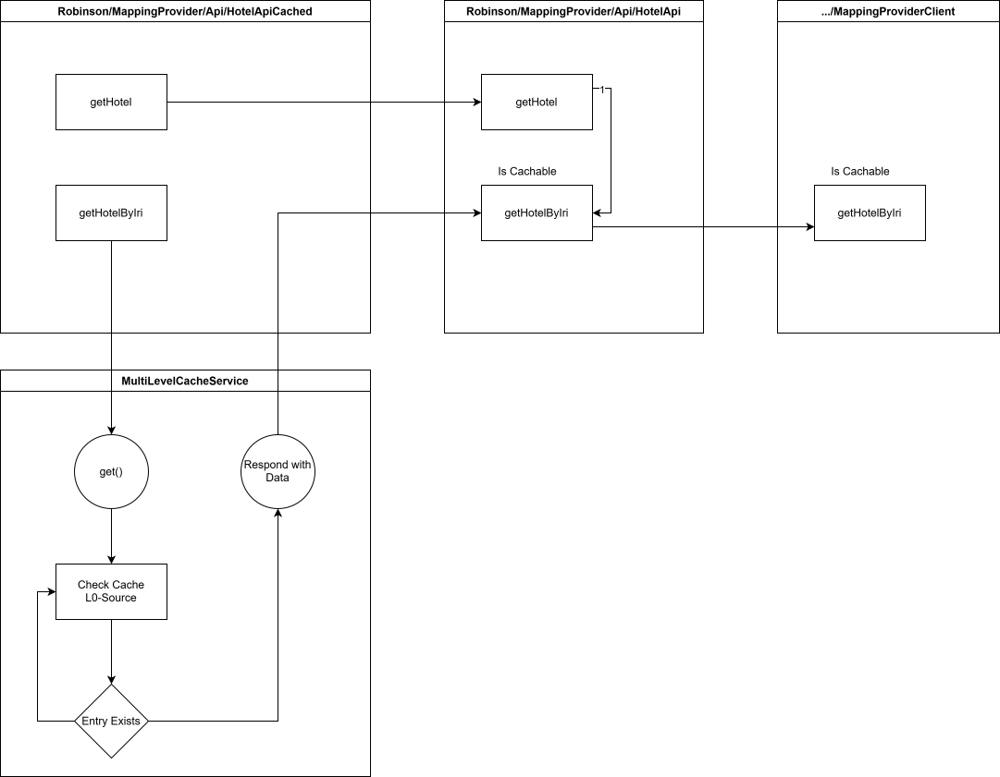
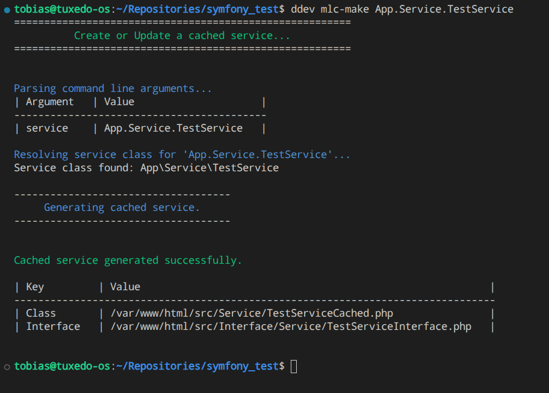
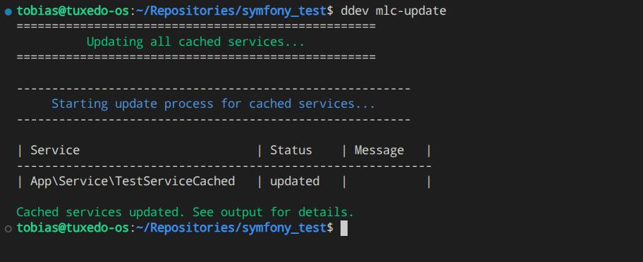

# MultiLevelCache Symfony Bundle

A high-performance, multi-level caching system for Symfony applications. This bundle provides a flexible, extensible, and developer-friendly way to combine multiple cache backends (memory, Redis, file, etc.) for optimal speed and reliability.

It has two parts to it.
1. The Multi Level Cache Itself.
2. The Cached Service Generator

The Main way of using this package is via the Cached Service Generator (CSG), so this will be the focus of this documentations. Details can be found [todo: write an actuall in depth documentation of the MLC] here

## Installation

Install via Composer from GitHub:

1. Require the package:
   ```bash
   composer require tbessenreither/multi-level-cache
   ```

> [!TIP]
> The following steps can be automated by using [Copycat](https://github.com/tbessenreither/copycat)

2. Enable the Bundle in `config/bundles.php`:
   ```php
   Tbessenreither\MultiLevelCache\MultiLevelCacheBundle::class => ['all' => true],
   ```
3. Configure Environment Variables as needed:
   - `REDIS_DSN` (if using Redis, so basically always)
   - `MLC_DISABLE_READ` (optional, disables cache reads)
   - `MLC_COLLECT_ENHANCED_DATA` (optional, enables enhanced data collection but has performance impact)

---


# The Multi-Level-Cache (MLC)

## Basic concept

Its a fast multi level cache consisting, in it's standard configuration, of:
- a fast In Memory Ring Cache
- and a second Level Redis Cache

## Most notable features

- Faster and much more Memory Efficient than the Symfony Cache (We love it, but we needed something faster)
- Cache statistics and profiling (Symfony Profiler integration)
- Beta decay and TTL randomization to prevent stampedes
- Exception handling and diagnostics

---

# The Cached Service Generator

This is the main thing you hopefully will interact with as the goal of this package is to make manual cache implementations a thing of the past.

## Overview

This is the main way of using the MLC. The basic idea is to implement your services without any caching logic and then wrapp them within an API Compatible Wrapper (Front Loaded Caching).

To create a cached version of a service you can use the `ddev mlc-make App.Service.TestService` command.

Cacheable Methods are marked as such with the `#[MlcCacheableMethod(ttlSeconds: 300)]` attribute.
Everything else is hands off.

## Basic relation between the Source and the Cached Service




## Usage

### Making your Service Ready for Caching

Given this example `TestService`

```php
<?php
declare(strict_types=1);

namespace Tbessenreither\Example\Service;

use Tbessenreither\Example\Entity\ExampleEntity;
use Tbessenreither\MultiLevelCache\CachedServiceGenerator\Attribute\MlcCacheableMethod;

readonly class TestService
{
    public function getOffers(string $id): ExampleEntity
    {
        return $this->getOffersByIri(sprintf('%s/%s', self::getApiUrl(), $id));
    }

    #[MlcCacheableMethod(ttlSeconds: 600)]
    public function getOffersByIri(string $iri): ExampleEntity
    {
        $brand = $this->getObjectContent(
            pageId: $iri,
            query: [],
            className: ExampleEntity::class
        );

        return $brand;
    }

    // [...]
}
```


### Generating the cached service

We've added the Attribute to the Endpoint we want to cache. And now we need to run `ddev mlc-make Tbessenreither.Example.Service` to generate our Cache wrapper. Now the following will happen.

1. It will create a `TestServiceInterface` for the `TestService`.
2. The Generator will create a wrapper under the name `TestServiceCached` that implements the `TestServiceInterface` to ensure compatibility
3. It will add the `TestServiceInterface` to the original Class

The Cache Wrapper is stored in the same directory as your Original `TestService` postfixed with `Cached` giving you `TestServiceCached`.

The `TestServiceInterface` will be put into the appropriate Interface directory.

Example Output of the `ddev mlc-make` command:



### Using the cached service

You basically have two options here.
1. You can either swap out the `TestService` for `TestServiceCached` directly as a drop in replacement
2. Or you can inject the `TestServiceInterface` and configure the Version you want to use via the `services.yaml`

Do whatever fits your needs best. The MLC has no opinions on how to do this.

### Updating the cached services

This is nice and all. But what if i change something in my `TestService`? Do i need to update everything again?

No, good god no.

You just run `ddev mlc-update`. This command will auto detect all Cache Wrappers and update them + the interfaces with the latest methods and `MlcCacheableMethod` annotations.

If any service can't be updated (There are some reasons why this might happen) it will show this in the status collumn and print a detailed reason in the Message collumn.

Example Output of the `ddev mlc-update` command:


---

## MultiLevelCacheService and MultiLevelCacheFactory

For details on how to use the MLC Service and Factory directly, please refer to the documentation [here](documentation/mlc-service-and-factory.md)

## License

MIT

# Contributors

Awesome people who contributed to this package

- [dsentker](https://github.com/dsentker)

## Honorable mentions
thanks for support go to:
- [Robinson-Software-Development](https://github.com/robinson-software-development)