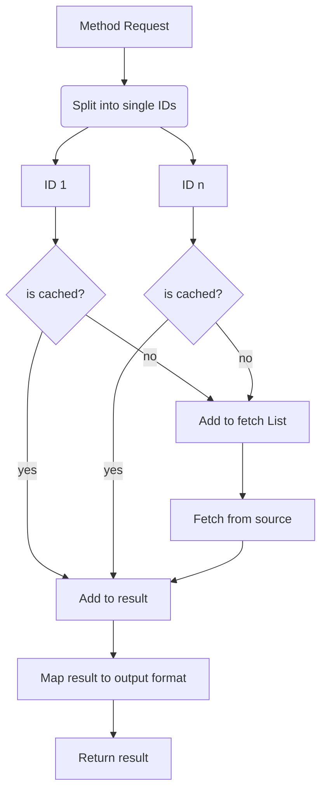
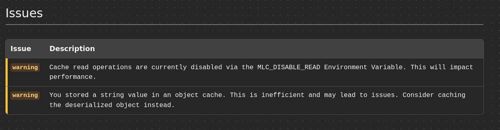
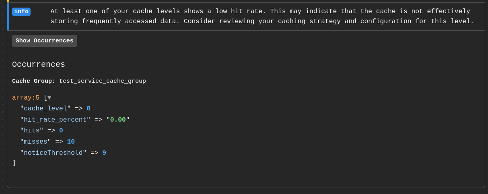
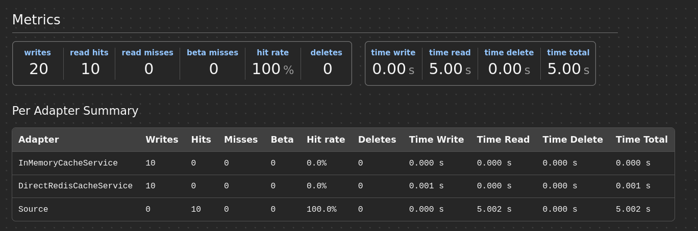
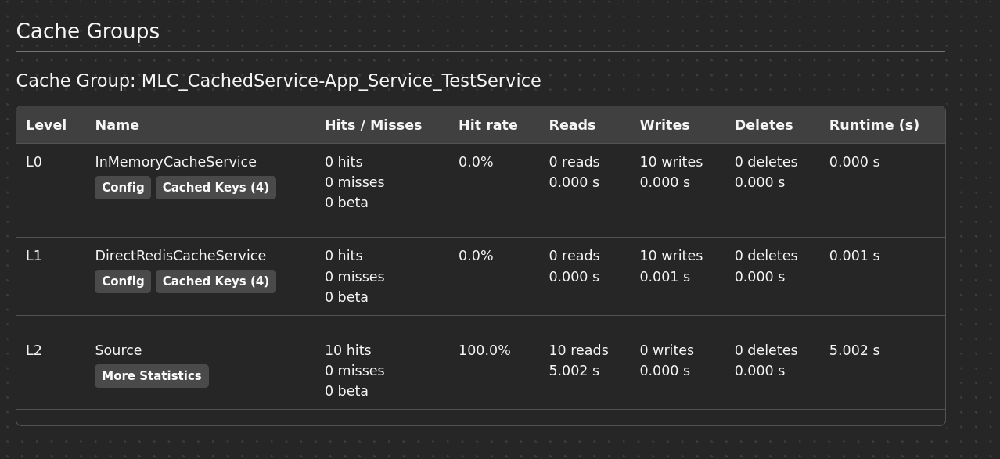

Index:
- [MultiLevelCacheService](#multilevelcacheservice)
- [MultiLevelCacheFactory](#multilevelcachefactory)

---


# MultiLevelCacheService

The `MultiLevelCacheService` is the core of the Multi Level Cache. It is responsible for handling the caching logic and providing a simple interface for caching your data.

The primary way of getting an instance of the Service is through the `MultiLevelCacheFactory` see [here](#multilevelcachefactory).


## Basic Usage

### Get

This is the most important function and probably the only one you will need to use.

```php
public function get(string $key, ?callable $callable = null, int $ttlSeconds = 300): object|string|int|float|bool|array|null
```

The get function is used by providing a cache key and a callable that will be executed in case of a cache miss. The result of the callable will then be stored in the cache and returned.

Optionally you can also provide a ttlSeconds argument that will override the default ttl for this specific cache entry.

Example:

```php
$cacheService->get(
	key: 'my_cache_key',
	callable: function() {
		// This callback will only be executed if the cache key is not found in any level of the cache.
		// You can put your expensive data fetching logic here.

		return 'my_expensive_data';
	},
	ttlSeconds: 600,
);
```

### getBulk

`getBulk` is a convenient method to fetch multiple entries at once. Each result is cached individually and only the missing entries are passed to the source callable. This allows you to further optimize the fetching of data without sacrificing your cache size and hit rate.


#### What it does:
This is the core concept of `getBulk`.


#### How it's done:
To use the `getBulk` method you need to pass in two arguments.

`methodCallObject` (`MethodCallObject`):

This object contains all the information about what should be fetched. This means the `class`, `method` and `arguments` that should be used to fetch the data in case of a cache miss.
If `class` of the `MethodCallObject` is a _string_, the MLC will try to call the Method as a static method. If it's an _object_, it will try to call it as a regular method.

`mlcCacheableMethodAttribute` (`MlcCacheableMethod`):

This object contains the cache configuration to be used as well as the `bulkConfig` that is needed for the `getBulk` method to work.

`bulkConfig` (`BulkConfig`):

This contains the `identifierSelector` that is used to deconstruct and reconstruct your result array. Currently this method supports _numeric_ and _associative_ arrays. The result mapping can be selected via the `listType` (`BulkListTypeEnum`) argument.


Now let's put this all together in an example:

```php
 $result = $cache->getBulk(
	methodCallObject: new MethodCallObject(
		class: $this,
		method: 'getTrueRandomStrings',
		arguments: [['key1', 'key2', 'key3']],
	),
	mlcCacheableMethodAttribute: new MlcCacheableMethod(
		ttlSeconds: 120,
		bulkConfig: new BulkConfig(
			identifierSelector: 'id',
			listType: BulkListTypeEnum::ARRAY_ASSOC,
		)
	)
);

// [...]


public function getTrueRandomStrings(array $keys): array
{
	var_dump('generating keys for', $keys);
	$strings = [];
	foreach ($keys as $key) {
		$strings[$key] = [
			'id' => $key,
			'value' => bin2hex(random_bytes(16)),
		];
	}
	return $strings;
}
```

For details on how to use this with the `Cached Service Generator` go to the [Bulk Config Section](./mlc-cachedservicegenerator.md#bulkconfig).


### Set

You can also set the cache value directly without using the get function. This can be useful if you want to pre-populate the cache or if you want to update the cache value without fetching it first.

```php
public function set(string $key, object|string|int|float|bool|array|null $object, int $ttlSeconds): void

$cacheService->set(
	key: 'my_cache_key',
	value: 'my_expensive_data',
	ttlSeconds: 600,
);
```

### Delete

Where there is light, there is also shadow. You can also delete cache entries if you want to invalidate the cache for a specific key.

```php
public function delete(string $key): void

$cacheService->delete('my_cache_key');
```

## Advanced Usage / Constructor

If you want to create your own instance of the `MultiLevelCacheService` without using the Factory, you can do so by providing an array of cache levels that implement the `MultiLevelCacheImplementationInterface`. This is probably only required for "weird edge cases" and is not recommended for most scenarios.

That being said, i'm a strong believer in foot-canons. If you need to shoot a foot, who am i to tell you no, i don't know your system.

```php
/**
 * @param array<int,MultiLevelCacheImplementationInterface> $caches
 * @param positive-int $ttlRandomnessSeconds amount of random seconds to add to ttl to avoid cache stampedes
 */
public function __construct(
	private array $caches,
	private readonly bool $writeL0OnSet = true,
	private ?Stopwatch $stopwatch = null,
	private ?MultiLevelCacheDataCollector $cacheDataCollector = null,
	private int $ttlRandomnessSeconds = 0,
	private string $cacheGroupName = '',
	#[Autowire('%env(defined:MLC_DISABLE_READ)%')]
	private bool $cacheReadDisabled = false,
)

$cacheService = new MultiLevelCacheService(
	caches: [
		new InMemoryCacheLevel(maxSize: 100),
		new RedisCacheLevel(redisClient: $redisClient, keyPrefix: 'mlc'),
	],
	writeL0OnSet: true,
	cacheGroupName: 'my_awesome_cache_group',
);
```

### The arguments

#### caches
An array of cache levels from L0 (first one to be checked) to Ln (last one to be checked). Each cache level must implement the `MultiLevelCacheImplementationInterface`. You can check `src/Service/Implementations` for some ready to use implementations and examples on how to create your own. Maybe you want to provide your own implementation, feel free to do so with a PR.

#### writeL0OnSet
Additionaly to default cache promotion every hit will also promote the value to the L0 cache.

#### stopwatch
You can provide a Stopwatch instance to enable timing of the cache operations. This is used for profiling and debugging purposes and is optional.

#### cacheDataCollector
You can provide a MultiLevelCacheDataCollector instance to enable data collection for the Symfony Profiler. This is used for profiling and debugging purposes and is optional but highly recommended.

#### ttlRandomnessSeconds
This randomizes the ttl of cache entries by adding a random amount of seconds to the ttl. This can be used to prevent cache stampedes by spreading out the expiration of cache entries. The value is in seconds and can be set to 0 to disable this feature.

#### cacheGroupName
See [Cache Groups](#cache-groups) in the Profiler section for details on what this does. In short, it allows you to group cache entries together for better insights in the Symfony Profiler.

#### cacheReadDisabled
This is an optional argument that can be used to disable cache reads. This can be useful for debugging purposes but should be used with caution as it will effectively disable the cache while still paying the cost of cache writes.


# MultiLevelCacheFactory

The `MultiLevelCacheFactory` is responsible for creating instances of the `MultiLevelCacheService`.

You can inject the Factory via DI into your service and then create a `MultiLevelCacheService` with the following default configurations:

## Constructor

you can pass in either the `$redisDsn` (autowired) or a `$redisClient` (`Redis`, `RedisCluster` or `RedisClientProviderInterface`) directly to the constructor of the Factory. If both are provided, the Factory will use the Redis Client and ignore the DSN.

Especially the `RedisClientProviderInterface` is useful if you want to provide a shared Redis Client that is used by multiple services so you only use one lazy connection instead of one per cache service.

Best practice is to autowire your custom Client Provider to `$redisClient` via `services.yaml` and then it will be automatically injected into the Factory.

## createByType

This method allows you to create a `MultiLevelCacheService` by one of the given presets. The Presets are defined in the `CacheTypeEnum` and are the following:

- `DEFAULT`: This is the `createDefault2LevelCache` preset.
- `IN_MEMORY`: This is the `createInMemoryOnlyCache` preset.
- `REDIS`: This is the `createRedisOnlyCache` preset.

```php
$this->cache = $multiLevelCacheFactory->createByType(
	type: CacheTypeEnum::DEFAULT,
	inMemoryCacheMaxSize: 100,
	redisKeyPrefix: 'mlc',
	writeL0OnSet: true,
	cacheGroupName: 'my_awesome_cache_group',
);
```

## createDefault2LevelCache

This is the default use case for the `MultiLevelCacheService`. It creates a cache service with two levels of caching. The first level is an in-memory cache and the second level is a Redis cache.

This is also the cache used by the Cached Service Generator and is the recommended way of using the MLC for most use cases.

```php
$cacheService = $factory->createDefault2LevelCache(
	inMemoryCacheMaxSize: 100,
	redisKeyPrefix: 'mlc',
	writeL0OnSet: true,
	cacheGroupName: 'my_awesome_cache_group',
);

$cacheService->get('my_cache_key', function() {
	// This callback will only be executed if the cache key is not found in any level of the cache.
	// You can put your expensive data fetching logic here.

	return 'my_expensive_data';
});
```


## createInMemoryOnlyCache

This is usefull to deduplicate repeating deserialized objects from requests or other string sources or to reuse expensive data that can't be stored in a more persistent cache for any reason.

```php
$cacheService = $factory->createInMemoryOnlyCache(
	inMemoryCacheMaxSize: 100,
	writeL0OnSet: true,
	cacheGroupName: 'my_awesome_cache_group',
);
```

## createRedisOnlyCache

If your use case does not benefit from de-duplication of objects or does not have a high number of repeating requests, it might be beneficial to only use a redis cache. The profiler will be helpful to determine if this is the case for your use case. (Hit rates per level are what you want to look at here)

```php
$cacheService = $factory->createRedisOnlyCache(
	redisKeyPrefix: 'mlc',
	writeL0OnSet: true,
	cacheGroupName: 'my_awesome_cache_group',
);
```

## Arguments

The MLC Factory methods accept the following arguments:

### inMemoryCacheMaxSize
The maximum number of items that can be stored in the in-memory cache. This is a simple LRU Cache, so if the limit is reached, the least recently used item will be evicted from the cache.

### redisKeyPrefix
The prefix that will be added to the start of all cache keys when storing data in Redis. This helps organize the cache keys and avoid collisions with other data in Redis. It also enables intentional sharing of cache data between different services if they use the same prefix.

A common use case for this is when you use the same client in different interconnected services and want to share the cached data between them.

### writeL0OnSet
Default is false.

If this is set to true, anytime a key is used it is immediately written to the L0 Cache. This means that if you have a cache miss on L1 but a hit on L2, the data will be written to L1 and L0 for faster access next time.

If this is useful for you highly depends on how your data is structured and how much different objects you have in your dataset. If you have a lot of different objects and a high turnover in your cache, this might lead to a lot of churn in your L0 Cache which can lead to performance issues. In this case, it's better to set this to false.
If you have a more stable dataset with less different objects and less turnover, this can lead to significant performance improvements as the L0 Cache is much faster than the L1 Cache. + You will deduplicate a LOT of objects in this case which can lead to significant memory savings.

### cacheGroupName
The cache group name is used for profiling and debugging purposes. This will give you separate performance metrics and insights within the symfony profiler (see [here](#cache-groups) ).


## The Profiler

This brings us to the Symfony Profiler support.

The Profiler provides the following sections for the MLC:


### Issues
Here you can see all issues that the MLC has raised during the request. It's mostly hints about how to best use it, notions about anti-patterns and potential misconfigurations. This is meant to help you to get the best performance out of the MLC and to avoid common pitfalls.



#### Additional insights
If you have enhanced data collection enabled, some of the issues will also provide you with additional insights to help you better use the MLC. For example, if you have a low hit rate on one of your cache levels a hint will show up with details about this.




### Metrics

This section shows on top, a overall summary of the cache performance. This includes:
- Total number of
	- writes
	- read-hits
	- read-misses
	- beta-misses
	- deletes
- The cache hit rate
- Time spent
	- writing
	- reading
	- deleting
	- total

And bellow that the same information but split by cache levels. This gives you a detailed overview of how your cache is performing and where potential bottlenecks are.



### Cache Groups

Last but not least, the Cache Groups section. Here you can see the performance metrics split by cache groups and Levels. This helps you dig down into the cache behaviour of specific cache instances.

This section is why you really want to set your `cacheGroupNamec` in the Factory when creating your cache service.


